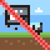
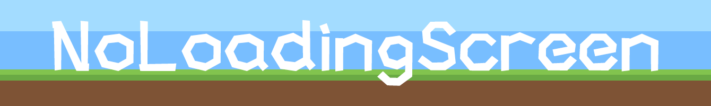
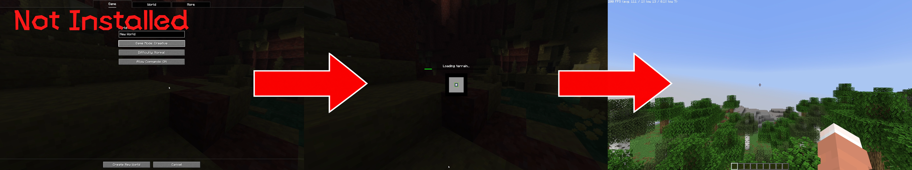
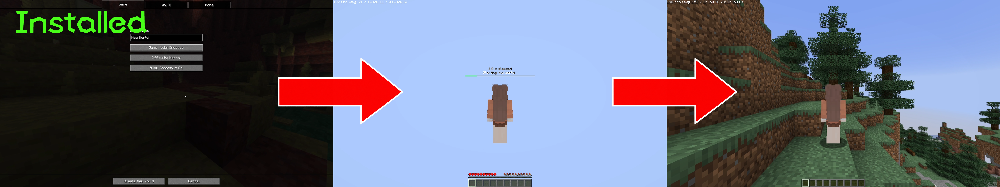

# NoLoadingScreen (NLS, No Loading Screen)

<p align="center">
  
  
</p>

**English** | [简体中文](README_zh-CN.md)

[](https://github.com/BingKKni/NoLoadingScreen/actions/workflows/build.yml)
[](docs/VERSIONS.md)
[](docs/VERSIONS.md)
[]()
[](LICENSE)

**Stop staring at loading screens while waiting to enter a world.**

NoLoadingScreen is a client-only Forge / Fabric / NeoForge mod. It hides Minecraft's "Loading terrain" and "Reconfiguring" screens when creating or joining a world, changing dimensions, or switching servers. Instead, it displays an observable placeholder world or the world you just left, so chunks can appear in front of you as they arrive.

> NoLoadingScreen primarily changes how loading is presented and when the client enters the world, while also optimizing parts of the world-loading process.

## Features



- Replaces loading screens and black frames with a free-look void placeholder!
- Keeps the world you just left visible while switching servers!
- Failed switches, kicks, and unexpected disconnects no longer force you out of the current world!

## Installation

Choose the matching build; **JARs for different loaders or game versions must not be mixed**:

| Minecraft | Loader | Java |
|---|---|---|
| 26.1 | Fabric / NeoForge (Beta) / Forge | 25 |
| 26.1.1 | Fabric / NeoForge (Beta) / Forge | 25 |
| 26.1.2 | Fabric / NeoForge / Forge | 25 |
| 26.2 | Fabric / NeoForge / Forge | 25 |
| 1.21.10 | NeoForge 21.10.64 | 21 |
| 1.21.11 | NeoForge 21.11.45 | 21 |

Pinned loader versions and artifacts for each version are listed in the [version matrix](docs/VERSIONS.md). Fabric requires Loader >=0.19.3.

1. Install [Fabric Loader](https://fabricmc.net/use/installer), [NeoForge](https://neoforged.net/), or [Forge](https://files.minecraftforge.net/) for your target.
2. Obtain the matching artifact from [Releases](https://github.com/BingKKni/NoLoadingScreen/releases), or build it using the [support/build matrix](docs/VERSIONS.md). All release JARs use the `NoLoadingScreen-version-loader-minecraft.jar` format, for example `NoLoadingScreen-1.1.0-Fabric-26.2.jar`.
3. Place the file in `.minecraft/mods/`.

This mod only needs to be installed on the client. Servers do not need it.

Fabric optionally uses [Mod Menu](https://modrinth.com/mod/modmenu). NeoForge and Forge expose the same settings in their Mod lists. The configuration file can also be edited directly.

## Configuration

Open the settings screen through Fabric Mod Menu, the NeoForge Mod list, or the Forge Mod list, or edit `.minecraft/config/noloadingscreen.json`.

| Option | Default | Description |
|:--|:--:|:--|
| Enable Mod | On | Master switch; disabling it restores vanilla behavior |
| Allow Movement While Loading | On | Walk, sprint, and jump in the placeholder world; double-tap Space to toggle flight, then use Space to ascend, Shift to descend, and move through blocks |
| In-World Loading Overlay | On | Shows the loading phase, elapsed time, and progress on the HUD |
| Show Join Time | Off | Prints total and per-phase join times in chat after entering the world |

## Compatibility

NeoForge 1.21.10 / 1.21.11 use Sodium 0.7.3 / 0.8.14 and ViaForge 4.3.1 / 4.3.2; these combinations have been tested. The optional optimization-mod matrix, exact versions, build commands, and validation limits are documented in the [NeoForge notes](docs/NEOFORGE.md).

The following existing results concern **Fabric 26.2**:

- Compatibility has been tested with Sodium `0.9.2+mc26.2`, ViaFabricPlus `4.6.1`, and ViaFabricPlus `5.0.1`; compatibility with other Minecraft or mod versions is not guaranteed.
- Other tested mods include Iris 1.11.4, ImmediatelyFast 1.16.4, Lithium 0.25.3, FerriteCore 9.0.0, EntityCulling 1.10.5, MoreCulling 1.8.1, Dynamic FPS 3.11.9, Sodium Extra 0.9.3, and RRLS 5.2.8.

## Known Behavior

- Startup warm-up adds time to client startup completion and does not guarantee a stutter-free world entry.
- Background meshing and frame budgets do not guarantee zero stalls: individual packet handlers, renderer teardown, GPU uploads, drivers, and resource reloads may still block. Loading protection continues for five seconds after early readiness; stages over 100 ms are reported in limited `[loading-work]` diagnostics. See [the findings and limits](docs/LOADING_IMPROVEMENTS.zh-CN.md).
- The mod releases the client readiness gate immediately, so the screen may briefly appear empty before chunks arrive. This is expected.
- Early placeholders use independently prepared vanilla registries asynchronously; until they are ready, or if placeholder creation fails, the corresponding vanilla loading screen remains available. See [the implementation and limits](docs/LOADING_IMPROVEMENTS.zh-CN.md).
- Although the mod was deliberately developed with multiplayer anti-cheat compatibility in mind, such as not fabricating packets and keeping processing synchronized, it cannot guarantee that an anti-cheat system will not detect or flag it. Reports from real multiplayer testing are welcome, including rubber-banding or repeated camera resets after installing the mod.

## Technical Details

Interested in the loading state machine, placeholder world, packet safety, Mixin injection points, and measured results? Read
[Implementation Details and Measurements](docs/TECHNICAL_DETAILS.md).

## Building From Source

```bash
./gradlew build
```

The root command still builds Fabric 26.2, with the artifact in `build/libs/`. Other targets use separate `-p platforms/<loader>-<minecraft>` builds; see the [build matrix and artifact names](docs/VERSIONS.md). Builds run the applicable headless regression and artifact checks. See the [transfer-fix testing guide](docs/TESTING.zh-CN.md) for in-game testing.

## License

[MIT](LICENSE) (c) 2026 BingKKni ([BingKKni](https://github.com/BingKKni))